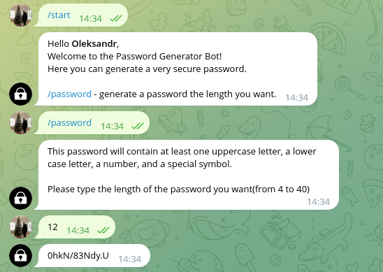
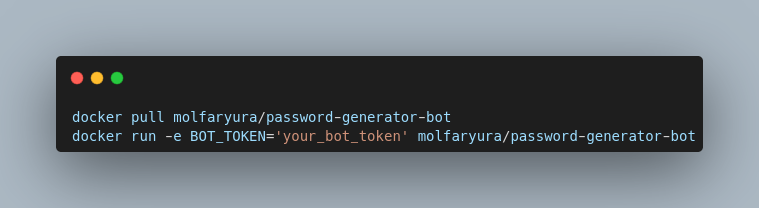

# Password Generator Telegram Bot  

## Brief description
- This simple bot was created using Python and it's modules: pyTelegramBotAPI, re
- Bot creates a password with at least one uppercase letter, one lowercase letter, number, and a special symbol using regular expressions.
- You can find this bot here https://t.me/secure_password_bot.

## Example

## Docker
If you want to launch a bot use this commands:

For more details please visit a [DockerHub](https://hub.docker.com/repository/docker/molfaryura/password-generator-bot)

## License

